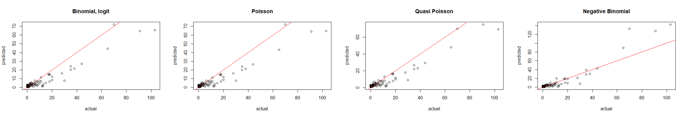

# Collection on mini projects in R

1.  HousePrices. The project performs EDA, detects outliers, does model selection out of set of linear regressions and compares, interprets the results.

    

2.  Olympics. The project develops model for predicting the number of medals won by each country at the Rio Olympics in 2016 using information that was available prior to the Games. At the data exploration step missing values are treated and variable engineering performed. A set of GLM models is tested: Linear regression, Binomial model, Poisson model, Quasi-Poisson model, Negative-Binomial model, Linear-mixed model. Negative Binomial model selected based on performance.

    

3.  OilClassification. The project predicts geographical region of olive oil using information about the spectroscopic measurements given for the samples. A number of classification methods has been explored including KNN, Decision trees and SVM with the final model being selected based on the prediction accuracy on validation data.

    

4.  Changepoint. The aim of this project is to explore application of sampling methods to evaluate the number and locations of changepoints in the coal mining data. Since the position of changepoints can move between the start and the end of the data the posterior distribution can no longer be evaluated through the conjugate update. In addition, with increasing number of changepoints analytical evaluation becomes more difficult. In this project we will look at two ways to overcome these difficulties: direct sampling and Markov Chain Monte Carlo (MCMC) using Gibbs sampler.

    

5.  NBA. In this project we will look at the NBA (National Basketball Association) dataset containing summary statistics on a number of basketball players during their rookie years. The aim of the project is to construct a regularised regression model using variables in the dataset to predict whether a basketball player will play more than 5 seasons in the NBA.

    
